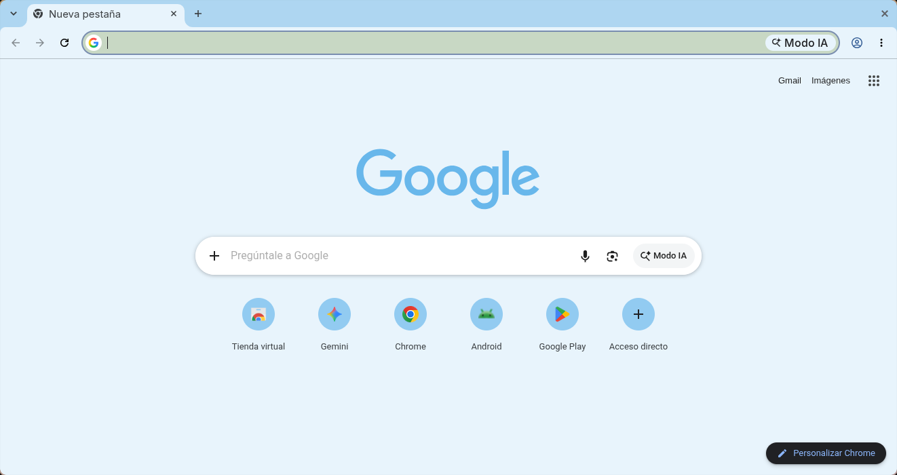

# Minimalist Snow Water ❄️

A minimal Chrome theme in a quiet, pale blue palette, by Miguel Euraque.

A pale ice-blue frame, a near-white toolbar and new tab page, and cool gray text. The palette is almost silver-blue, like cold snow water, quiet and very light.

## Features

- **Palette:** pale ice-blue frame, near-white surfaces, cool gray text
- **Minimalist design:** clean and uncluttered
- **Easy installation:** Chrome Manifest V3
- **Gentle on the eyes:** low-contrast colors that stay easy to read

## Installation

### Chrome Web Store (recommended)

1. Visit the [Minimalist Snow Water](https://chromewebstore.google.com/detail/minimalist-snow-water/aafhkecmmhfpcifhhkacjblaboiepfgn) page in the Chrome Web Store.
2. Click **Add to Chrome**.

### From source

1. Clone this repository.
2. Open `chrome://extensions` and turn on Developer mode.
3. Click **Load unpacked** and select the theme folder.
